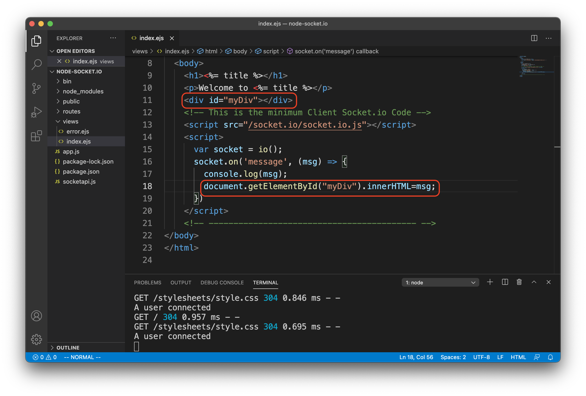
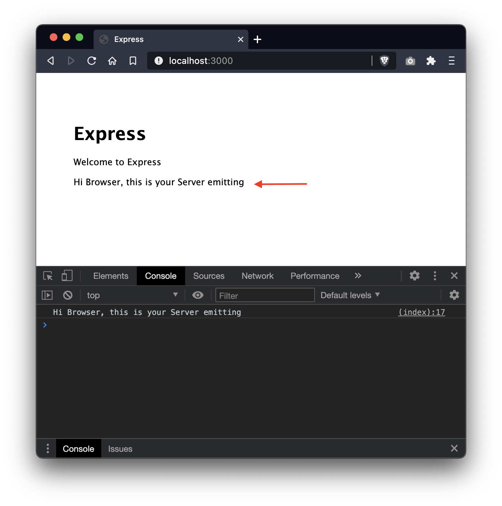

# Minimal Configuration of Socket.io & Express-Generator Recipe

## **Objective:** 
Configure socket.io to work with the default skeleton templates created by the  Express.js Application Generator.

## **Prerequisites:** 
1. [Node.js](https://nodejs.org/en/download/) v14.15.0
2. [nodemon](https://nodemon.io/) v2.0.7
3. [Express.js](https://expressjs.com/) v4.16.1
4. [npm](https://www.npmjs.com/) v 7.5.4
5. [Socket.io](https://socket.io/) v3.1.1

Before proceeding, ensure the first *four* prerequisites are correctly installed on your system and running without errors.

## **Preamble:**

There are many tuts online explaining how to get Socket.io working with NodeJS but few explaining how to do this specifically with [Express Application Generator](https://expressjs.com/en/starter/generator.html). The generator uses some legacy naming and coding conventions that can be confusing and often doesn't align with the online tuts. This example, aims to be acciessible to the beginner and illustrate the setup in the most basic minimal fashion.

---

## Step 1 - Generate the Express skeleton

Using Express Generator, create a folder structure populated with the default templates. We'll call this example `node-socket.io`.

    express -e ejs node-socket.io

Navigate into the new project folder and install socket.io and supporting npm packages. 

    cd node-socket.io
    npm install socket.io --save
    npm install

## Step 2 - Configure the socket listener 

Edit the file `bin\www` and create two new entries. The first will call (`require`) a new file we'll create later, containing our application specific socket.io code. 

    let socketapi = require("../socketapi");

The second entry will create a socket listner and configure it using the application code in the new file `socketapi.js`.

    socketapi.io.attach(server);

## Step 3 - Setup the server-side emitter 

Create a new file called `socketapi.js` at the top level of the project folder. To keep things simple we will put our socket processing logic in its own file and isolate it from the rest of the Express skeleton. This can be considered the *configuration* of the socket listener we created in the previous step.

When it senses a connection from a client it will log a console message at the server, and send back a text string to the client.

Paste in the following code...

    const io = require( "socket.io" )();
    const socketapi = { io: io };

    io.on( "connection", (socket) => {
        console.log( "A user connected" );
        io.emit('message', 'Hi Browser, this is your Server emitting');
        io.on('disconnect', () => {
            console.log(" A user disconnected");
        })
    });

    module.exports = socketapi;

## Step 4 - Configure the browser-side client

Open and edit the file `views/index.js` and add the following code snippet to the `<body>`. This will file will be served up by Express, and this `
    

**Note:** Socket.io is comprised of two parts - the server-side libraries (`socket.io`), and a browser-side library (`socket.io.js`).

If everything is wired correctly, the server-side process will respond to this `<script>` call and serve up the browser-side library. Response to this request is handled by Socket.io and **NOT** by node.js or any Express route. So don't be tempted to put this client library somewhere like `public/`.

    <script src="/socket.io/socket.io.js">

## Step 5 - Test the socket listener 

Start the node app with `node bin/www` or `nodemon bin/www`. 

Load the app in the browser and examine the developer console.

The socket.io server has detected a client connection and *emitted* data back. This data (`msg`) is logged in the console. 

## Step 6 - Using the emitted data in the page body

If you need to use the emiited `msg` in the page body, add two additional lines to the `index.ejs`.

---

## This concludes the basic, minimal setup.